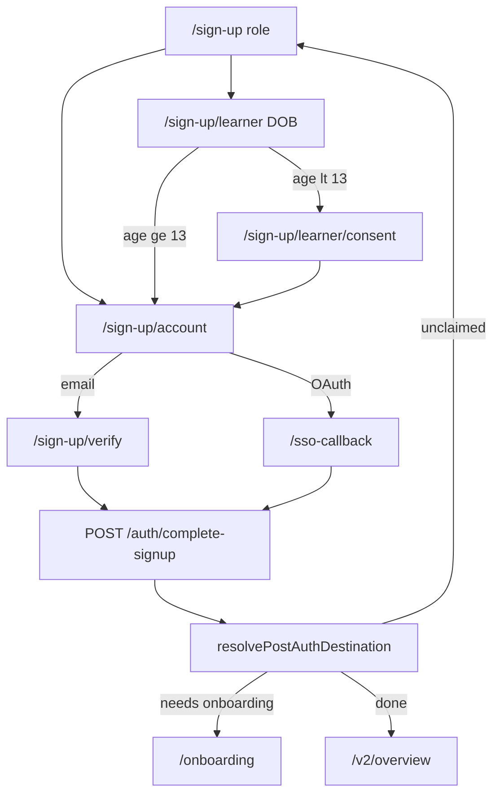

> **Execution status (2026-09-09):** Phases 2–4 implemented. Vitest 168/168, i18n
> strict clean, `next build` green, lint clean, backend 1701 passed + ruff/mypy
> clean. **Deferred to CI:** Playwright smoke (sandbox lacks network for
> `fonts.gstatic.com` — dev server won't boot); specs already updated
> (`e2e/landing-page.spec.ts`, `e2e/login-error.spec.ts`, `e2e/session-expiry.spec.ts`).
> Everything is uncommitted WIP on `main`.

# Auth & Landing Redesign — Phases 2–4

Source: [docs/prd/auth-landing-redesign-spec.md](docs/prd/auth-landing-redesign-spec.md), [docs/adr/0013-role-first-signup-wizard.md](docs/adr/0013-role-first-signup-wizard.md).

**Already done:** Phase 0 (fonts, primitives, `(auth)/layout.tsx`) · Phase 1 (migration, `/auth/signup-intent`, `/complete-signup`, `/onboarding`, extended `/auth/me`).

**Wire roles correctly:** UI label “learner”; API/DB value always `"student"`. Routes keep `/sign-up/learner` as specified.

**Backend onboarding is thinner than the spec prose:** [`OnboardingRequest`](src/api/auth.py) only has `grade_level` + `subject`. Student: grade 7–12 required; teacher: collect `subject`; parent: POST `{}` (or optional subject) to set `onboarding_completed_at`. No `school` / `child_link_code` in this pass (follow-up tickets).

---

## Phase 2 — Signup wizard + resolver

### Shared libs

- [`dashboard/src/lib/auth/resolveDestination.ts`](dashboard/src/lib/auth/resolveDestination.ts) — `resolvePostAuthDestination(me, requestedNext?)`:
  - `!role_claimed` → `/sign-up`
  - `!onboarding_completed` → `/onboarding`
  - else → `safeNextPath` / `/v2/overview`
- [`dashboard/src/lib/auth/signupDraft.ts`](dashboard/src/lib/auth/signupDraft.ts) — sessionStorage draft `{ role, dob?, parentEmail? }` so DOB/consent survive until account step (cookie can only be set after ToS because backend requires `tos_accepted`).
- [`dashboard/src/lib/auth/age.ts`](dashboard/src/lib/auth/age.ts) — client age helper for routing to consent (server still authoritative).
- Thin API helpers (always `credentials: "include"`): `postSignupIntent`, `postCompleteSignup`, `postOnboarding`, typed `AuthMe` from `/auth/me`.

### Routes under existing [`(auth)/layout.tsx`](dashboard/src/app/(auth)/layout.tsx)

| Route | Behavior |
|-------|----------|
| `/sign-up` | Role cards Learner/Teacher/Parent; honor `?role=`; write draft; navigate |
| `/sign-up/learner` | Month/Day/Year `Select`s; age ≥13 → account; else → consent |
| `/sign-up/learner/consent` | Parent email `FormField`; Accordion for consent details |
| `/sign-up/account` | ToS checkbox → `POST /auth/signup-intent` → Google/Microsoft `OAuthButton` (`oauth_google` / `oauth_microsoft`, `redirectUrl: /sso-callback`) or email+password → verify |
| `/sign-up/verify` | Clerk `email_code` → `complete-signup` → resolver |
| `/onboarding` | Role-specific form → `POST /auth/onboarding` → `/v2/overview` |
| `/sso-callback` | Move from marketing; after `handleRedirectCallback` → `complete-signup` (if cookie) → resolver (drop `?role_claim=1`) |

Every wizard step: “← Choose a different role” → `/sign-up`; `StepDots` where multi-step; framer-motion ~160ms slide/fade.

### i18n

Add full `signup.*` / `onboarding.*` key trees to [`messages/en.json`](dashboard/messages/en.json) + [`messages/am.json`](dashboard/messages/am.json) (parity CI).

### Tests

Vitest: `resolveDestination` matrix, age util, draft guards (missing draft → redirect `/sign-up`). Smoke Playwright path deferred with Phase 3 e2e bundle if timeboxed; unit coverage is the Phase 2 gate.

---

## Phase 3 — Login + recovery + cutover

### New / rewritten `(auth)` pages

- [`(auth)/login/page.tsx`](dashboard/src/app/(auth)/login/page.tsx) — **sign-in only**: Google · Microsoft · email/password · “Forgot password?” · “Create an account” → `/sign-up`. No register toggle, no claim step. On success: `complete-signup` if cookie present, else resolver.
- [`(auth)/forgot-password/page.tsx`](dashboard/src/app/(auth)/forgot-password/page.tsx) — Clerk `reset_password_email_code` → code + new password → `/login`.

### Cutover deletes / redirects

- Delete mega-component + re-exports: `(marketing)/login/`, `(marketing)/sign-in/`, `(marketing)/sign-up/`, `(marketing)/sso-callback/`.
- `(auth)/sign-in/page.tsx` → `redirect('/login')` (preserve query).
- Update [`middleware.ts`](dashboard/src/middleware.ts): public `/, /login(.*), /sign-up(.*), /forgot-password(.*), /sso-callback(.*), /auth(.*), /api(.*)`; unauthenticated protected → `/login?redirect_url=…` (not `/sign-in`).
- Update [`fetchWithAuth.ts`](dashboard/src/lib/fetchWithAuth.ts) 401 redirect → `/login`.
- Update login tests / e2e that target old paths.

---

## Phase 4 — Landing polish

All in [`(marketing)/`](dashboard/src/app/(marketing)/) (dark Verge retained).

| ID | Change |
|----|--------|
| L1 | Dismissible teacher banner → `/sign-up?role=teacher`; `localStorage` key `ethiosci_banner_teacher_dismissed` |
| L2 | Hero: “Start learning” → `/sign-up?role=learner`; Telegram ghost; “Log in” text |
| L3 | Role panels → `/sign-up?role={student\|teacher\|parent}` (map learner card to `?role=learner` → draft `student`) |
| L4 | `#faq` Accordion + 8 Q&As (§8.1) en/am + `FAQPage` JSON-LD; footer FAQ link |
| L5 | Footer: “Login / Verify OTP” → “Log in” → `/login` |
| L6 | Console tabs labeled Demo + caption |
| L7 | Split page: server shell + `next/dynamic` for ConsoleTabs/StatsSection |
| L8 | Metadata/OG + Organization JSON-LD + `sitemap.ts` |
| L9 | Focus-visible mint, contrast bump if needed, `prefers-reduced-motion` |

Update [`e2e/landing-page.spec.ts`](dashboard/e2e/landing-page.spec.ts) for new CTAs/FAQ/banner.

---

## Verify (end of each phase, full suite at end)

1. `cd dashboard && npx vitest run` (resolver, wizard utils, primitives)
2. `node scripts/check-i18n.mjs`
3. `npm run build` (network for fonts)
4. Playwright smoke: signup happy path (mocked Clerk if needed), login, forgot-password, landing FAQ/banner
5. No backend edits required unless a cookie-proxy bug appears; `pytest` only if Python touched

## Out of scope (spec §12)

Workspace auth hardening, Telegram linking, teacher verification, parental-consent email delivery, `school`/`child_link_code` onboarding fields, donation surface.
